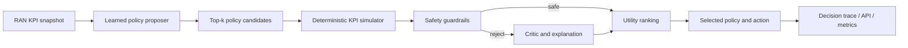

# Agentic-RAN

[](https://github.com/vtavakkoli/Agentic-RAN/actions/workflows/ci.yml)
[](https://www.python.org/)
[](LICENSE)
[](docker-compose.yml)

**Agentic-RAN is a lightweight, explainable, and safety-guarded policy-selection engine for radio access networks.** It converts a compact KPI snapshot into an actionable network policy for eMBB, URLLC, or mMTC without requiring a GPU or an external LLM.

The project intentionally focuses on **policy selection**, not large forecasting architectures. A small classifier proposes candidates; an agentic control loop simulates each candidate, checks hard safety constraints, critiques unsafe options, and selects the highest-utility safe policy.

## Why this design

- **Agentic control loop:** observe → propose → simulate → guard → critique → select.
- **Safe by construction:** the ML proposal is advisory; deterministic guardrails control execution.
- **Edge-friendly:** scikit-learn model, CPU-only runtime, small Docker image, millisecond-scale local inference.
- **Explainable:** every response includes candidate scores, predicted KPI effects, rejections, and the final rationale.
- **Reproducible:** Docker Compose downloads a compact dataset, trains the model, starts the API, and can run the full test/benchmark workflow.
- **Operationally useful:** typed API, health/readiness endpoints, Prometheus-format metrics, batch decisions, web demo, CI, and benchmark reports.

## Architecture



The policy proposer learns from a compact, transparent bootstrap dataset. The final selector does not blindly copy the model prediction: it evaluates expected latency, loss, throughput, stability, energy load, PRB pressure, and radio quality for every candidate.

## Included policies

| Policy | Primary purpose |
|---|---|
| `balanced` | Stable proportional-fair baseline and mandatory fallback |
| `latency_guard` | Protect URLLC latency and packet-loss objectives |
| `throughput_boost` | Increase eMBB throughput when capacity is available |
| `congestion_relief` | Reduce overload, burst pressure, and packet loss |
| `energy_saver` | Lower energy use during safe low-load periods |
| `coverage_recovery` | Improve weak-SINR/RSRP and handover conditions |
| `massive_iot_access` | Stabilize dense mMTC access patterns |

Policies are declarative and editable in [`configs/policies.yaml`](configs/policies.yaml).

## Quick start with Docker Compose

```bash
# Dataset download → model training → API startup
docker compose up --build
```

Open:

- Web demo: `http://localhost:8080`
- OpenAPI: `http://localhost:8080/docs`
- Readiness: `http://localhost:8080/readyz`
- Metrics: `http://localhost:8080/metrics`

The `dataset` service downloads the small CSV configured by `AGENTIC_RAN_DATASET_URL`. If the network is unavailable, it creates the exact same schema through a deterministic local generator, making the workflow usable in isolated labs and CI.

Run the complete containerized tests and benchmark:

```bash
docker compose --profile test up --build \
  --abort-on-container-exit --exit-code-from test test
```

## Local development

```bash
python -m venv .venv
source .venv/bin/activate          # Windows: .venv\Scripts\activate
python -m pip install -e ".[dev]"

agentic-ran generate-data --output data/runtime/ran_policy_sample.csv
agentic-ran train --data data/runtime/ran_policy_sample.csv
agentic-ran serve --port 8080
```

Useful commands:

```bash
make lint
make typecheck
make coverage
make compose-test
```

## Example decision

```bash
curl -s http://localhost:8080/v1/decisions \
  -H 'content-type: application/json' \
  -d '{
    "cell_id": "vienna-lab-01",
    "slice_type": "URLLC",
    "prb_utilization": 0.91,
    "active_users": 84,
    "downlink_mbps": 48,
    "uplink_mbps": 11,
    "latency_ms": 24,
    "jitter_ms": 7,
    "packet_loss_pct": 0.7,
    "throughput_demand_mbps": 62,
    "energy_load": 0.86,
    "handover_failure_pct": 1.3,
    "rsrp_dbm": -101,
    "sinr_db": 8
  }'
```

Representative response fields:

```json
{
  "selected_policy": "latency_guard",
  "confidence": 0.82,
  "safety_override": false,
  "action": {
    "scheduler": "deadline_aware",
    "prb_share_delta": 0.12,
    "tx_power_db_delta": 0.5
  },
  "expected_kpis": {
    "latency_ms": 13.44,
    "packet_loss_pct": 0.462
  },
  "candidates": [],
  "trace": {}
}
```

The actual response contains the complete evaluated candidate list and decision trace.

## Dataset

The repository includes a compact bootstrap sample under `data/bootstrap/` and a deterministic generator in `agentic_ran/data.py`. Each row contains:

- slice and cell identifiers;
- PRB utilization and active users;
- downlink/uplink throughput and demand;
- latency, jitter, and packet loss;
- energy load and handover failures;
- RSRP and SINR;
- one transparent expert-policy label.

The sample is designed for software validation and policy-selection experiments. It is **not operator ground truth** and must not be used to claim production-network performance. Replace it with approved network telemetry before deployment.

## API surface

| Method | Path | Purpose |
|---|---|---|
| `GET` | `/healthz` | Liveness |
| `GET` | `/readyz` | Model and policy readiness |
| `GET` | `/metrics` | Prometheus text metrics |
| `GET` | `/v1/policies` | Policy catalog |
| `POST` | `/v1/decisions` | One policy decision |
| `POST` | `/v1/decisions/batch` | Up to 500 observations |

## Safety model

The guard layer currently blocks or penalizes actions when they would:

- reduce radio power for weak-coverage users;
- enable energy saving while URLLC is near/outside SLA;
- increase PRB pressure beyond the configured envelope;
- apply throughput boost during critical congestion;
- exceed the ±3 dB transmit-power action boundary;
- worsen packet loss or SINR beyond hard thresholds.

These controls are examples, not a replacement for operator policy, digital-twin validation, change approval, or O-RAN integration testing. See [Architecture](docs/ARCHITECTURE.md) and [Model Card](docs/MODEL_CARD.md).

## Repository layout

```text
agentic_ran/          Core dataset, model, agent, API, CLI, and reporting code
configs/              Declarative network-policy catalog
data/bootstrap/       Small reproducible policy-selection dataset
.github/workflows/    Quality, test, package, and Docker checks
tests/                Unit, API, integration, safety, and benchmark tests
docs/                 Architecture and model documentation
Dockerfile            Multi-stage non-root runtime image
docker-compose.yml    Download, train, API, and test workflow
```

## Benchmarking

```bash
agentic-ran benchmark \
  --data data/runtime/ran_policy_sample.csv \
  --output results \
  --limit 400
```

This creates `results/benchmark.json` and `results/benchmark.html` with end-to-end decision latency, policy distribution, expert-label agreement, and safety-override rate. Metrics are measured on the current machine and should be regenerated for every target platform.

## Governance and limitations

- The included impact model is a lightweight surrogate, not a radio digital twin.
- Bootstrap labels are generated by documented rules and are not operator annotations.
- Before live control, integrate approved telemetry, policy constraints, canary rollout, audit logging, and rollback.
- Treat selected actions as recommendations until validated against the target RIC/RAN environment.
- Do not place subscriber identifiers or sensitive operational data in the demo dataset.

## Contributing

See [CONTRIBUTING.md](CONTRIBUTING.md). Security reports should follow [SECURITY.md](SECURITY.md).

## License

MIT License. See [LICENSE](LICENSE).
