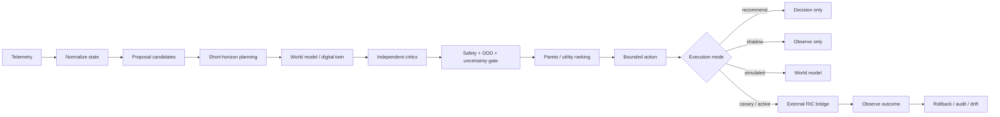

# Agentic-RAN

[](https://github.com/vtavakkoli/Agentic-RAN/actions/workflows/ci.yml)
[](https://www.python.org/)
[](LICENSE)
[](compose.yaml)

**Agentic-RAN is a safety-governed research platform for agentic intelligence in Open RAN, with reproducible real-data benchmarking and explicit deployment-readiness gates.**

The project combines lightweight learned policy proposals with short-horizon planning, pluggable RAN world models, independent critics, uncertainty/OOD gates, multi-cell coordination, rollback and audit. Version 2.1 adds a real-measurement pipeline and multi-model selection benchmark so model choice is based on more than synthetic accuracy.

> **Machine learning proposes. World models predict. Independent critics verify. Deterministic safety logic owns execution authority.**

An LLM, when enabled for explanation, never sits on the control path.

## Why this repository is different

Agentic-RAN is designed around three separate evidence layers:

1. **Deterministic bootstrap data** for reproducible development and unit tests.
2. **Public real-world 5G measurements** for external shadow realism and model comparison.
3. **Live RIC/gNB telemetry** for laboratory shadow, canary and eventual controlled experimentation.

The repository never labels public-data proxy targets as operator ground truth and never labels an HTTP bridge as E2AP.

## Agentic control cycle



## One-command real-data benchmark

Docker Compose prefers `compose.yaml`, which defines the complete evidence pipeline:

```bash
docker compose --profile test up --build --abort-on-container-exit --exit-code-from test test
```

The dependency chain is:

```text
prepare-data
   ↓
model-selection
   ↓
report
   ↓
test
```

When it finishes, open:

```text
results/report.html
```

The same stages can be run separately:

```bash
docker compose up --build prepare-data
docker compose up --build model-selection
docker compose up --build report
```

### What `prepare-data` does

The source catalog is `configs/data_sources.yaml`. The default profile downloads public 5G measurement datasets from their original Zenodo records, verifies the published MD5 checksum, normalizes heterogeneous Excel tables and writes compressed outputs:

```text
data/
├── bootstrap/ran_policy_sample.csv
├── raw/                              # downloaded originals; local only
└── prepared/
    ├── real_measurements.csv.gz      # normalized measured KPIs
    ├── real_policy_eval.csv.gz       # complete model schema + provenance columns
    └── provenance.json               # DOI/checksum/source statistics
```

The current catalog includes:

- **Telenor/COMMECT 5G private-network forestry measurements** — RSRP, downlink/uplink throughput, latency and jitter; DOI `10.5281/zenodo.16919567`.
- **Glasgow 5G Dataset 2025** — signal strength, download/upload throughput and ping across multiple providers/devices; DOI `10.5281/zenodo.20465872`, CC BY 4.0.

Raw third-party files are not redistributed by this repository. The compressed prepared data is generated locally. See `docs/REAL_DATA.md`.

### Measured versus derived RAN inputs

Public measurement datasets do not expose every internal RAN counter used by the controller. Agentic-RAN therefore preserves explicit metadata on every prepared row:

- `measured_fields`
- `observed_model_features`
- `derived_model_features`
- `realism_score`

Missing internal fields are completed by transparent deterministic proxies in `agentic_ran/real_features.py`. The generated `policy_label` is the repository's expert-rule reference and **is not an operator action or production ground truth**.

## Production-oriented model selection

`agentic-ran select-model` compares four CPU-friendly policy proposers:

| Candidate | Purpose |
|---|---|
| HistGradientBoosting | nonlinear compact baseline |
| ExtraTrees | robust ensemble baseline |
| RandomForest | interpretable bagged-tree baseline |
| LogisticRegression | simple calibrated linear baseline |

The winner is not chosen by accuracy alone. The production score combines:

- **45%** synthetic hold-out macro-F1;
- **25%** real expert-reference macro-F1;
- **15%** prediction stability under KPI perturbation;
- **10%** probability calibration;
- **5%** single-observation inference latency.

The selected model is retrained with all bootstrap data plus a **capped** amount of real expert-referenced data, preventing proxy-labelled public data from dominating the training distribution.

## `results/report.html`

The report is a self-contained deployment-evidence artifact containing:

- dataset provenance, DOI, checksums and row counts;
- measured-feature coverage and realism score;
- all candidate models and their ranking metrics;
- selected model/version;
- real-data policy distribution, confidence, OOD and uncertainty;
- safe-selection and safety-override rates;
- deterministic guardrail results;
- synthetic end-to-end latency/throughput benchmark;
- readiness gates and an explicit final verdict.

Possible verdicts are:

- `NEEDS CALIBRATION`
- `RESEARCH-READY`
- `SHADOW-READY`

**`SHADOW-READY` is intentionally not `PRODUCTION-READY`.** Active control requires a calibrated RIC/gNB laboratory, authenticated transport, operator approval, rollback drills, long-duration shadow validation and independent safety/security review.

## Core platform capabilities

### Planning and digital twin

- configurable multi-step counterfactual rollouts;
- `RANWorldModel` abstraction;
- transparent bounded surrogate model;
- trace-replay world model;
- external ns-3 / calibrated digital-twin adapters;
- world-model uncertainty carried into the decision.

### Safety and trustworthy control

- bounded transmit-power and PRB actions;
- independent SLA, energy, stability and uncertainty critics;
- telemetry age/completeness penalties;
- feature-envelope OOD detection;
- conservative balanced fallback;
- temporal policy dwell/churn guards;
- canary allow-list and control envelope;
- measured-outcome rollback evaluation.

### Intent-driven optimization

Built-in profiles include `balanced`, `urllc-strict`, `embb-capacity`, `mmtc-reliability` and `green-ran`. Each intent can define constraints, objective weights, risk tolerance and an energy budget. Safe non-dominated candidates are exposed through a Pareto front.

### Multi-cell intelligence

`MultiCellCoordinator` detects interference-sensitive conflicts across neighboring cells and penalizes locally attractive decisions that create network-level risk. It is a research baseline and must be calibrated before network-optimal claims.

### Forecasting and RL baselines

- persistence, EWMA, linear-trend and ensemble forecasting;
- Fitted Q Iteration for offline discrete-action learning;
- constrained RL wrapper with an explicit safety predicate.

RL remains a proposal/baseline source and cannot bypass the authoritative safety layer.

### Governance and MLOps

- SHA-256 hash-chained decision audit records;
- model artifact registry and hashes;
- drift monitoring;
- model-promotion gates;
- model/version metadata in every decision.

### O-RAN / srsRAN boundaries

Telemetry providers support synthetic observations, CSV replay, srsRAN JSON WebSocket metrics, decoded E2SM-KPM dictionaries and Prometheus projection. The control side includes a bounded E2SM-RC bridge abstraction and Near-RT xApp / Non-RT rApp orchestration primitives.

**Protocol boundary:** Agentic-RAN does not pretend that HTTP JSON is E2AP. ASN.1/E2AP/E2SM encoding and SCTP transport belong to a standards-capable O-RAN SC, FlexRIC or equivalent RIC/xApp binding. See `docs/ORAN_INTEGRATION.md`.

## Execution modes

| Mode | RAN change | Intended use |
|---|---:|---|
| `recommend` | No | API/research decision support |
| `shadow` | No | live telemetry evaluation |
| `simulated` | Twin only | closed-loop laboratory experiments |
| `canary` | allow-listed lab cells only | bounded isolated validation |
| `active` | external bridge | validated research environment only |

The default is **`recommend`**.

## Local Python quick start

```bash
python -m venv .venv
source .venv/bin/activate
python -m pip install -e ".[dev,oran]"

agentic-ran generate-data --output data/runtime/ran_policy_sample.csv
agentic-ran train --data data/runtime/ran_policy_sample.csv
agentic-ran serve --port 8080
```

Real-data commands are also available outside Docker:

```bash
agentic-ran prepare-real-data
agentic-ran select-model
agentic-ran production-report
```

## Existing REST API

```text
GET  /healthz
GET  /readyz
GET  /metrics
GET  /v1/policies
POST /v1/decisions
POST /v1/decisions/batch
```

## Live srsRAN shadow mode

```bash
agentic-ran xapp-shadow --url ws://127.0.0.1:8001 --steps 20 --intent balanced
```

Shadow mode records decisions without changing the RAN.

## Repository structure

```text
agentic_ran/
├── actuation.py          execution modes, bridge boundary, rollback
├── audit.py              tamper-evident audit
├── control_loop.py       observe → decide → act → verify
├── coordinator.py        multi-cell coordination
├── data_adapters.py      heterogeneous real-KPI normalization
├── data_sources.py       source catalog/download integrity
├── engine.py             planner, critics and selector
├── model_selection.py    multi-model production benchmark
├── production_report.py  results/report.html generator
├── real_data.py          real-data preparation orchestration
├── real_features.py      measured/derived feature completion
├── safety.py             OOD, uncertainty and temporal safety
├── telemetry.py          synthetic, replay, srsRAN, KPM, Prometheus
└── twin.py               surrogate/replay/external world models

configs/data_sources.yaml  public real-data catalog
compose.yaml               preferred real-data Docker workflow
docs/REAL_DATA.md          data semantics and limitations
results/report.html        generated readiness report
```

## Research positioning

The flagship question is not "which classifier predicts policy labels best?" It is:

> **Can a safety-governed agentic controller improve heterogeneous RAN utility while maintaining explicit SLA and safety constraints under disturbances, uncertainty and distribution shift?**

Recommended outcome metrics include SLA violation rate, safety rejection rate, rollback frequency, recovery time, throughput-demand satisfaction, latency, packet loss, energy/throughput trade-off, policy churn, OOD behavior, multi-cell utility and decision latency.

## Production limitations

Agentic-RAN is a **research platform**, not a certified mobile-network controller. Before production deployment, calibrate the world model and feature mappings using approved network data, verify the exact RIC/gNB release and service models, add authenticated control transport and external immutable audit, perform long-duration shadow and isolated canary validation, define operator approval/rollback procedures, and complete independent safety/security review.

## License

MIT License. Third-party datasets retain their original terms. See each source record in `configs/data_sources.yaml`.

## Citation

If Agentic-RAN supports academic work before a formal paper is published, cite the repository and the exact version or commit used. `CITATION.cff` is included.
