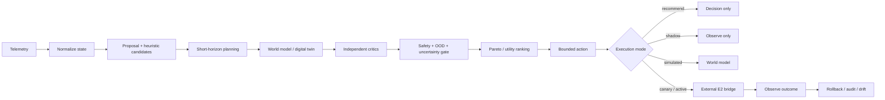

# Agentic-RAN

[](https://github.com/vtavakkoli/Agentic-RAN/actions/workflows/ci.yml)
[](https://www.python.org/)
[](LICENSE)
[](docker-compose.yml)

**Agentic-RAN is a safety-governed research platform for agentic intelligence in Open RAN.**

Version 2 evolves the original lightweight policy-selection engine into a modular control architecture with short-horizon planning, pluggable world models, uncertainty and out-of-distribution gating, independent critics, SLA intents, Pareto optimization, multi-cell coordination, forecasting, offline RL baselines, rollback, tamper-evident audit, model governance, and xApp/rApp integration boundaries.

The central rule is intentionally conservative:

> **Machine learning proposes. World models predict. Independent critics verify. Deterministic safety logic owns execution authority.**

An LLM, when used for operator explanation, never sits on the control path.

## Agentic control cycle



## What v2 implements

### Planning and digital twin

- configurable multi-step candidate rollouts;
- `RANWorldModel` abstraction;
- transparent bounded surrogate model;
- trace-replay world model;
- external adapters for ns-3 or calibrated srsRAN/digital-twin services;
- world-model uncertainty carried into the final decision.

### Safety and trustworthy control

- hard transmit-power and PRB action bounds;
- SLA, energy, stability and uncertainty critics;
- telemetry age/completeness penalties;
- feature-envelope OOD detection;
- conservative balanced fallback;
- temporal policy dwell/churn guards;
- canary allow-list and execution envelope;
- measured-outcome rollback evaluation.

### Intent-driven optimization

Built-in profiles include:

- `balanced`
- `urllc-strict`
- `embb-capacity`
- `mmtc-reliability`
- `green-ran`

Each intent can define explicit SLA constraints, objective weights, risk tolerance and an energy budget. The selector also reports non-dominated safe choices on a Pareto front.

### Multi-cell intelligence

`MultiCellCoordinator` checks locally good decisions against neighboring cells and applies transparent penalties for interference-sensitive power changes, critical neighboring load, and mobility conflicts. This is intentionally a research baseline; calibrate it before making network-optimal claims.

### Forecasting and RL baselines

- persistence, EWMA, linear-trend and ensemble forecasting;
- Fitted Q Iteration for offline discrete-action learning;
- constrained RL wrapper that filters learned choices through an explicit safety predicate.

RL remains a proposal/baseline source and cannot bypass the authoritative safety layer.

### Governance and MLOps

- SHA-256 hash-chained decision audit records;
- deterministic audit verification;
- model artifact registry and hashes;
- drift monitoring;
- model-promotion gates combining quality, drift and safety-rate thresholds;
- model/version metadata in decisions.

### O-RAN / srsRAN boundaries

Telemetry providers support:

- synthetic live-like observations;
- CSV trace replay;
- srsRAN JSON WebSocket metrics;
- transport-neutral decoded E2SM-KPM dictionaries;
- Prometheus metric projection.

The control side includes a bounded E2SM-RC bridge adapter plus generic Near-RT xApp and Non-RT rApp orchestration primitives.

**Protocol boundary:** Agentic-RAN does not pretend that an HTTP JSON object is E2AP. Real ASN.1/E2AP/E2SM encoding and SCTP transport belong to a standards-capable O-RAN SC, FlexRIC, or equivalent RIC/xApp binding. See `docs/ORAN_INTEGRATION.md`.

## Execution modes

| Mode | RAN change | Intended use |
|---|---:|---|
| `recommend` | No | API/research decision support |
| `shadow` | No | Live telemetry evaluation |
| `simulated` | Twin only | Closed-loop laboratory experiments |
| `canary` | Only allow-listed cells through configured bridge | Bounded isolated-lab validation |
| `active` | Through configured bridge | Validated research environment only |

The default is **`recommend`**.

## Quick start

```bash
python -m venv .venv
source .venv/bin/activate
python -m pip install -e ".[dev,oran]"

agentic-ran generate-data --output data/runtime/ran_policy_sample.csv
agentic-ran train --data data/runtime/ran_policy_sample.csv
agentic-ran serve --port 8080
```

Existing v1 REST endpoints remain compatible:

```text
GET  /healthz
GET  /readyz
GET  /metrics
GET  /v1/policies
POST /v1/decisions
POST /v1/decisions/batch
```

## Safe simulated closed loop

```bash
agentic-ran control-step --mode simulated --intent green-ran
```

This runs synthetic telemetry through forecasting, proposal, planning, world-model rollout, critics, OOD/uncertainty gating, selection, simulated execution, rollback arming and audit.

## Live srsRAN shadow mode

```bash
agentic-ran xapp-shadow \
  --url ws://127.0.0.1:8001 \
  --steps 20 \
  --intent balanced
```

Shadow mode consumes live metrics and records decisions without changing the RAN.

## Development bridge

For software-path integration tests only:

```bash
agentic-ran serve-bridge --port 8090
```

The development bridge validates the generic control-boundary payload and provides an external-world-model contract. It is **not** an E2AP implementation and must not be exposed as a production control endpoint.

## Resilience benchmark

Built-in fault scenarios cover traffic spikes, cell outage, backhaul degradation, poor radio, handover instability, packet-loss bursts, stale telemetry, corrupted KPI input, model shift and neighbor interference.

```bash
agentic-ran resilience --file observation.json
```

For publication-quality evaluation, compare static/heuristic control, learned proposer, Fitted-Q, constrained RL, an MPC/external-world-model baseline when available, and full Agentic-RAN. Run ablations without the twin, OOD, uncertainty, critics, temporal guard, rollback and multi-cell coordination. See `docs/RESEARCH_BENCHMARK.md`.

## Repository structure

```text
agentic_ran/
├── actuation.py      execution modes, E2 bridge boundary, rollback
├── audit.py          tamper-evident audit log
├── bridge.py         safe local development bridge
├── control_loop.py   observe → decide → act → verify orchestration
├── coordinator.py    multi-cell conflict resolution
├── domain.py         typed observations, intents, decisions and envelopes
├── engine.py         planner, critics and selector
├── forecasting.py    advisory traffic/load forecasting
├── intents.py        SLA intents and Pareto analysis
├── mlops.py          registry, drift and promotion gates
├── operator.py       trace explanation / optional external LLM adapter
├── ric.py            Near-RT xApp / Non-RT rApp orchestration primitives
├── rl.py             offline Fitted-Q and constrained RL baseline
├── safety.py         OOD, uncertainty and temporal safety
├── scenarios.py      fault injection / resilience benchmark
├── telemetry.py      synthetic, replay, srsRAN, E2-KPM, Prometheus sources
└── twin.py           surrogate/replay/external world models

docs/
├── ARCHITECTURE.md
├── ORAN_INTEGRATION.md
├── RESEARCH_BENCHMARK.md
└── ROADMAP.md
```

## Research positioning

The flagship question is not "which classifier predicts policy labels best?" It is:

> **Can a safety-governed agentic controller improve heterogeneous RAN utility while maintaining explicit SLA and safety constraints under disturbances, uncertainty and distribution shift?**

Recommended outcome metrics include SLA violation rate, safety rejection rate, autonomous approval rate, rollback frequency, recovery time, throughput-demand satisfaction, latency, packet loss, energy/throughput trade-off, policy churn, OOD behavior, multi-cell utility and decision latency.

## Production limitations

Agentic-RAN is a **research platform**, not a certified mobile-network controller. Before any production deployment, calibrate the world model with approved network data; verify every telemetry/control mapping against the exact RIC/gNB release; add authenticated control transport and external immutable audit; perform long-duration shadow and isolated canary validation; define operator approval/rollback procedures; and complete independent safety/security review.

## License

MIT License. See `LICENSE`.

## Citation

If Agentic-RAN supports academic work before a formal paper is published, cite the repository and the exact version or commit used. `CITATION.cff` is included.
